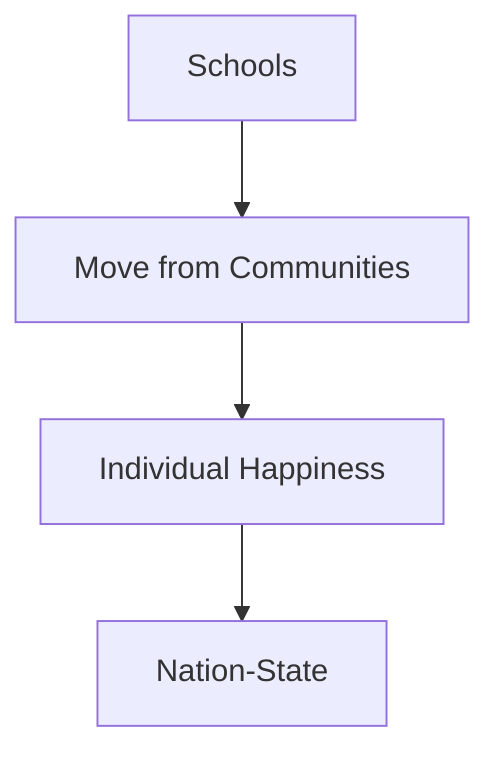

# How Power Works?
This lecture revolves around how powerful people really control the middle class. I am documenting this lecture just out of curiosity so I can research a bit more on what is said in this lecture. I always believed Schools hinders the growth of those students who really want to explore more but can not due to highly regid systems in place. I had personally felt this during my education and this resonates me. I am inclined to find more substance on this topic and really understand how elites tries to shape the world. 

## Source
[Lecture on YouTube](https://www.youtube.com/watch?v=ajFXykT9Joo)

## Key Takeaways
- Why do we have schools?
- The move from Communities to Indivisual happyness
- The idea of Nation state

## 📊 Concept Flow
